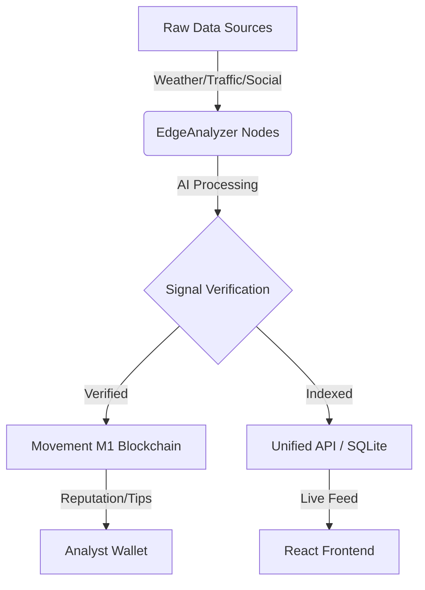

# 🔮 Fourcast: Multi-Domain Signal Intelligence Layer

**The first modular intelligence layer for the Movement network.** Fourcast aggregates off-chain data (Weather, Mobility, Sentiment), processes it via AI edge nodes, and publishes verifiable prediction signals on-chain.


## 🎯 The Problem

Prediction markets like Polymarket require sophisticated data analysis to win. Most tools are siloed (only weather, or only crypto prices). Developers building new signal feeds have to rebuild the entire stack (contracts, indexing, analysis) from scratch.

## 💡 Our Solution

Fourcast is a **generic signal infrastructure**. We built a unified pipeline that allows *any* data domain to be analyzed and published to the Movement network using a single standard.

### Key Innovations

1.  **EdgeAnalyzer Engine**: A polymorphic AI analysis pattern. Whether it's analyzing rain probability or stadium traffic, the logic flow remains identical.
2.  **@fourcast/signal-sdk**: A developer-first SDK to spin up new signal domains in minutes, not days.
3.  **Unified Reputation**: Analysts earn on-chain reputation (and tips!) regardless of the domain they predict on.

---

## 🚀 Features

### 🌐 Multi-Domain Intelligence
- **🌤️ Weather Domain**: Real-time analysis of forecast impact on event outcomes (e.g., "Will it rain in London?").
- **🚗 Mobility Domain**: *NEW!* Crowd/Traffic analysis for sports events (e.g., "High turnout at Wembley?").
- **🧠 Sentiment Domain**: (Coming Soon) Farcaster/social sentiment analysis.

### 🛠️ For Developers (Bounty: Best DevEx)
- **Signal SDK**: Zero-config library to publish to our generic Move contract.
- **CLI Tools**: Scaffolding for new domain analyzers.

### 📱 For Consumers (Bounty: Best Consumer App)
- **Live Intelligence Feed**: Real-time stream of verified signals.
- **Context-Aware Dashboard**: 3D visualizations that adapt to the signal type (Weather vs Mobility).
- **On-Chain Tipping**: Reward top analysts directly on the Movement network.

---

## 🏗️ Architecture



### Tech Stack
- **Frontend**: Next.js 15, React 19, Tailwind CSS, Three.js
- **Backend**: Node.js, SQLite (Turso), Redis
- **AI**: Venice.ai (Llama-3.3-70b) via `EdgeAnalyzer` abstraction
- **Blockchain**: Movement M1 Testnet (Move)
- **DevEx**: TypeScript SDK

---

## ⚡ Quick Start

### 1. Installation

```bash
git clone https://github.com/your-username/fourcast.git
cd fourcast
npm install
```

### 2. Environment Setup

Copy `.env.local.example` to `.env.local` and add your keys:

```bash
# Movement M1 Testnet Config
NEXT_PUBLIC_APTOS_NETWORK=custom
NEXT_PUBLIC_APTOS_NODE_URL=https://testnet.movementnetwork.xyz/v1
NEXT_PUBLIC_APTOS_MODULE_ADDRESS=0x25789991c3c0238539509fee5ff4e3789cfcd84763e3d1c3d625947b04c1fb8c
```

### 3. Run the App

```bash
npm run dev
```

### 4. Run the Signal Pipeline (Demo)

This script acts as an Edge Node, fetching real data and publishing signals:

```bash
node scripts/run-analysis-flow.js
```

---

## 📦 Using the SDK

Want to build your own signal feed?

```typescript
import { SignalPublisher } from '@fourcast/signal-sdk';

const publisher = new SignalPublisher({ network: 'custom', ... });

await publisher.publish({
  domain: 'mobility',
  title: 'Knicks Game High Turnout',
  confidence: 'HIGH'
});
```

See [SDK Documentation](./sdk/SDK.md) for full details.

---

## 📜 Contract Addresses (Movement M1)

| Contract | Address |
|----------|---------|
| Signal Registry | `0x25789991c3c0238539509fee5ff4e3789cfcd84763e3d1c3d625947b04c1fb8c` |
| Marketplace | `0x25789991c3c0238539509fee5ff4e3789cfcd84763e3d1c3d625947b04c1fb8c` |

---

## 🤝 Contributing

We welcome new Domain Analyzers! Check out `services/analysis/EdgeAnalyzer.js` to see how to extend the base class.

## 📄 License

MIT
