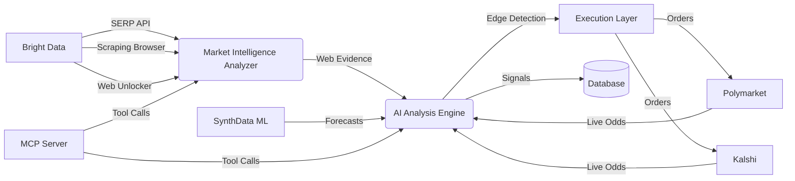

# 🔮 Fourcast: AI Agent Powered by Live Web Data for Market Intelligence

**AI agent using Bright Data (SERP API + Scraping Browser + Web Unlocker) to detect mispriced prediction markets across Polymarket & Kalshi in real-time.**


## The Problem

Prediction markets (Polymarket, Kalshi) are frequently mispriced because participants can't access real-time web intelligence at scale. Rate limits, bot detection, JavaScript-rendered pages, and geo-blocks prevent AI agents from reasoning over live data.

## The Solution

Fourcast uses **Bright Data's full infrastructure stack** to unlock the web for AI-powered market intelligence:

1. **SERP API** — Structured real-time search results for any market question
2. **Scraping Browser** — JS-rendered deep research on high-value sources (CAPTCHAs solved automatically)
3. **Web Unlocker** — Bot-detection bypass for paywalled/protected financial sites
4. **MCP Server** — Exposes the full pipeline to any MCP-compatible AI agent (Claude, Cursor, LangChain)

The agent scrapes live evidence → synthesizes with AI → detects market mispricing → recommends trades with Kelly Criterion sizing.

---

## How Bright Data Powers Fourcast

```
┌─────────────────────────────────────────────────────────────────┐
│                    BRIGHT DATA PIPELINE                          │
├─────────────────────────────────────────────────────────────────┤
│                                                                  │
│  ┌──────────┐    ┌──────────────────┐    ┌──────────────┐      │
│  │ SERP API │───▶│ Scraping Browser  │───▶│ Web Unlocker │      │
│  │          │    │                   │    │              │      │
│  │ Structured│    │ JS-rendered pages │    │ Bot bypass   │      │
│  │ search    │    │ CAPTCHA solving   │    │ Geo-unblock  │      │
│  └────┬─────┘    └────────┬──────────┘    └──────┬───────┘      │
│       │                   │                      │              │
│       └───────────────────┼──────────────────────┘              │
│                           ▼                                      │
│              ┌────────────────────────┐                          │
│              │   AI Synthesis Engine   │                          │
│              │   (Venice AI / LLM)     │                          │
│              └────────────┬───────────┘                          │
│                           ▼                                      │
│              ┌────────────────────────┐                          │
│              │   Edge Detection        │                          │
│              │   Fair probability vs   │                          │
│              │   market price          │                          │
│              └────────────┬───────────┘                          │
│                           ▼                                      │
│              ┌────────────────────────┐                          │
│              │   Polymarket / Kalshi   │                          │
│              │   Cross-venue execution │                          │
│              └────────────────────────┘                          │
└─────────────────────────────────────────────────────────────────┘
```

### Bright Data Integration Details

| Product | Usage | Code |
|---------|-------|------|
| **SERP API** | Fetches top 5 structured results for each market question | `services/brightDataService.js` |
| **Scraping Browser** | Renders JS-heavy pages (CoinDesk, Bloomberg) via Puppeteer WebSocket | `services/brightDataService.js` |
| **Web Unlocker** | Bypasses paywalls (WSJ, FT) when Scraping Browser unavailable | `services/brightDataService.js` |
| **MCP Server** | Exposes tools to external AI agents via Model Context Protocol | `app/api/mcp/route.js` |

### Data Flow Example

1. User asks: "Will Bitcoin exceed $150K by August 2026?"
2. **SERP API** fetches 5 structured Google results (ETF flows, analyst predictions, on-chain data)
3. **Scraping Browser** deep-scrapes the top result (e.g., CoinDesk article — JS-rendered, 16K chars)
4. **Web Unlocker** fetches paywalled FT article as fallback
5. AI synthesizes 27 evidence sentences → produces fair probability (58%)
6. Compares to Polymarket price (42%) → detects +16% edge
7. Recommends BUY YES with Kelly-sized position

---

## Features

### Web Intelligence Pipeline
- **Real-time SERP results** with organic listings, knowledge panels, People Also Ask
- **Deep JS scraping** with automatic CAPTCHA solving and 2-minute timeout
- **Bot detection bypass** for rate-limited and geo-blocked sources
- **10-minute LRU cache** (200 entries) to minimize credit usage during demos
- **Source provenance** — every prediction shows exactly which Bright Data product fetched each evidence piece

### AI Analysis
- **Venice AI** (Llama 3.3 70B) for fast analysis (~7.5s, ~$0.01/call)
- **Deep mode** (Qwen3-235B) for high-conviction markets (~67s, ~$0.03/call)
- **Confidence scoring** with HIGH/MEDIUM/LOW labels
- **Counter-signals** — AI reports what would change its mind

### Market Intelligence
- **Polymarket + Kalshi** live odds in one view
- **Cross-platform arbitrage** detection
- **Kelly Criterion sizing** for optimal position sizing
- **Autonomous agent loop** — scans, filters, forecasts, executes

### MCP Server (Model Context Protocol)
- `search_web` — Query Bright Data SERP API from any AI agent
- `scrape_page` — Scrape JS-rendered pages via Scraping Browser
- `analyze_market` — Full intelligence pipeline in one tool call
- `get_market_odds` — Live prediction market prices

Compatible with Claude, Cursor, LangChain, CrewAI, and any MCP client.

---

## Quick Start

### 1. Install

```bash
git clone https://github.com/thisyearnofear/fourcast.git
cd fourcast
npm install
```

### 2. Configure Bright Data

Get $250 in credits with promo code `unlocked` at [brightdata.com](https://brightdata.com).

```bash
cp .env.example .env.local
```

```env
# Required: Bright Data (web intelligence)
BRIGHT_DATA_API_KEY=your_api_key
BRIGHT_DATA_SERP_ZONE=your_serp_zone

# Optional: Deep research (JS-rendered pages)
BRIGHT_DATA_SBR_WS_ENDPOINT=wss://brd-customer-xxx-zone-yyy@brd.superproxy.io:9222

# Optional: Bot detection bypass (paywalled sites)
BRIGHT_DATA_UNLOCKER_ZONE=your_unlocker_zone

# Required: AI
VENICE_API_KEY=your_venice_api_key
```

### 3. Run

```bash
npm run dev
```

Open `http://localhost:3000` — the demo works even without API keys (fallback data included).

### 4. Check Bright Data Status

```bash
curl http://localhost:3000/api/brightdata/status
```

### 5. Use MCP Server

```bash
curl -X POST http://localhost:3000/api/mcp \
  -H "Content-Type: application/json" \
  -d '{"jsonrpc":"2.0","id":1,"method":"tools/list"}'
```

---

## Architecture


```mermaid
graph LR
    BD[Bright Data] -->|SERP API| MIA(Market Intelligence Analyzer)
    BD -->|Scraping Browser| MIA
    BD -->|Web Unlocker| MIA
    PM[Polymarket] -->|Live Odds| AI(AI Analysis Engine)
    KA[Kalshi] -->|Live Odds| AI
    MIA -->|Web Evidence| AI
    SD[SynthData ML] -->|Forecasts| AI
    AI -->|Edge Detection| EX[Execution Layer]
    AI -->|Signals| DB[(Database)]
    EX -->|Orders| PM
    EX -->|Orders| KA
    MCP[MCP Server] -->|Tool Calls| MIA
    MCP -->|Tool Calls| AI
```

### Tech Stack
- **Web Intelligence**: Bright Data (SERP API, Scraping Browser, Web Unlocker, MCP)
- **Frontend**: Next.js 15, React 19, Tailwind CSS, Three.js
- **AI**: Venice AI (Llama 3.3 70B, Qwen3-235B)
- **Backend**: Node.js, SQLite/Turso, Redis
- **Markets**: Polymarket CLOB, Kalshi API
- **Settlement**: Arc (Circle L1) for USDC, Movement/Aptos legacy

---

## API Endpoints

| Endpoint | Purpose |
|----------|---------|
| `POST /api/mcp` | MCP Server — AI agent tool interface |
| `GET /api/mcp` | MCP Server capabilities discovery |
| `GET /api/brightdata/status` | Bright Data product availability |
| `POST /api/intelligence/analyze` | Full analysis pipeline |
| `GET /api/markets` | Live market discovery |
| `POST /api/agent/demo` | Streaming demo (no keys needed) |
| `GET /api/agent/demo` | Static demo summary |

---

## Hackathon

**Bright Data Web Data UNLOCKED Hackathon**  
Track 2: Finance & Market Intelligence

> "Multi-source synthesis engines delivering structured company or sector intelligence objects"

Fourcast demonstrates exactly what becomes possible when AI agents have unrestricted access to live web data:
- Markets that were opaque become transparent
- Information asymmetries that took hours to find are detected in seconds
- Evidence that was locked behind bot detection is unlocked and structured

**Bright Data products used**: SERP API, Scraping Browser, Web Unlocker, MCP Server (4/7 products)

---

## License

MIT
