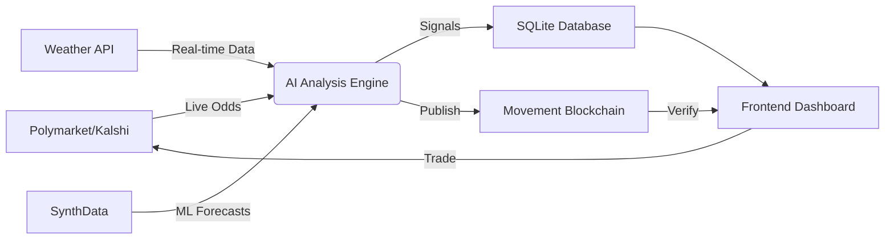

# 🔮 Fourcast: Multi-Chain Prediction Market Intelligence

**AI-powered analysis for prediction markets with on-chain signal publishing and cross-platform trading.**


## 🎯 What We Do

Fourcast helps traders find edge in prediction markets through:
- **AI-powered analysis** - Venice AI (Llama 3.3 70B) with 200+ ML models across crypto, sports, politics & more
- **Multi-platform trading** - Polymarket & Kalshi integration with live odds
- **On-chain signals** - Publish verifiable predictions to Movement/Aptos blockchain
- **DeFi arbitrage** - Detect price discrepancies across platforms

---

## 🚀 Features

### For Traders
- **Live Market Analysis** - AI-generated predictions with confidence scores (HIGH/MEDIUM/LOW)
- **ML-Backed Forecasts** - SynthData integration for crypto/equity price predictions (BTC, ETH, SOL, SPY, NVDA, etc.)
- **Sports & Events Intelligence** - Weather-aware analysis for sports and event markets
- **Cross-Platform Arbitrage** - Find mispriced odds between Polymarket and Kalshi
- **Direct Trading** - Place orders on Polymarket/Kalshi from the interface

### For Analysts
- **Signal Publishing** - Publish predictions on-chain (Movement testnet)
- **Reputation System** - Track win rates, Brier scores, and accuracy streaks
- **Tipping** - Earn APT for high-quality signals
- **Leaderboards** - Compete with other analysts

### For Developers
- **Unified API** - Access markets, signals, and AI analysis
- **SDK** - Build custom signal publishers and domain analyzers
- **Modular Architecture** - Extend with new data sources and chains

---

## 🏗️ Architecture


```mermaid
graph LR
    A[Polymarket/Kalshi] -->|Live Odds| B(AI Analysis Engine)
    C[Weather API] -->|Real-time Data| B
    D[SynthData] -->|ML Forecasts| B
    B -->|Signals| E[SQLite Database]
    B -->|Publish| F[Movement Blockchain]
    E --> G[Frontend Dashboard]
    F -->|Verify| G
    G -->|Trade| A
```

### Tech Stack
- **Frontend**: Next.js 15, React 19, Tailwind CSS, Three.js
- **Backend**: Node.js, SQLite (Turso), Redis
- **AI**: Venice AI (Llama 3.3 70B) with Edge Search
- **Blockchains**: 
  - Movement/Aptos (signal publishing, tipping)
  - BNB, Polygon, Arbitrum (trading contracts)
- **Data Sources**: Polymarket, Kalshi, Open-Meteo, SynthData

---

## ⚡ Quick Start

### 1. Installation

```bash
git clone https://github.com/thisyearnofear/fourcast.git
cd fourcast
npm install
```

The pre-commit hook will install automatically to protect against committing secrets.

### 2. Environment Setup

Copy `.env.local.example` to `.env.local`:

```bash
# Required: AI & Weather
VENICE_API_KEY=your_venice_api_key
NEXT_PUBLIC_WEATHER_API_KEY=your_weather_api_key

# Optional: Movement (signal publishing)
NEXT_PUBLIC_APTOS_NETWORK=custom
NEXT_PUBLIC_APTOS_NODE_URL=https://testnet.movementnetwork.xyz/v1
NEXT_PUBLIC_MOVEMENT_MODULE_ADDRESS=0x...

# Optional: Polymarket Trading
POLYMARKET_PRIVATE_KEY=your_private_key

# Optional: Kalshi Trading
KALSHI_API_KEY=your_api_key
```

See [Setup Guide](./docs/SETUP.md) for complete configuration.

### 3. Run the App

```bash
npm run dev
```

Navigate to `http://localhost:3000`

---

## 📂 Project Structure

```
fourcast/
├── app/                    # Next.js pages and components
├── components/             # React components (UI, 3D, trading)
├── services/               # Backend services (AI, markets, chains)
├── sdk/                    # Signal SDK for developers
├── move/                   # Move contracts (signal registry)
└── docs/                   # Documentation
```

---

## 📊 Supported Platforms

| Platform | Purpose | Status |
|----------|---------|--------|
| Polymarket | Live odds, trading | ✅ Live |
| Kalshi | Live odds, trading | ✅ Live |
| Movement/Aptos | Signal publishing, tipping | ✅ Testnet |
| BNB Chain | Trading contracts | 🧪 Beta |
| Polygon | Trading contracts | 🧪 Beta |
| Arbitrum | Trading contracts | 🧪 Beta |

---

## 📚 Documentation

- **[Features](./docs/FEATURES.md)** - What works today vs. future roadmap
- **[Setup Guide](./docs/SETUP.md)** - Installation, environment, wallets
- **[Architecture](./docs/ARCHITECTURE.md)** - System design and data flows
- **[API Reference](./docs/API_REFERENCE.md)** - All endpoints and schemas
- **[Deployment](./docs/DEPLOYMENT.md)** - Production deployment guide

---

## 🤝 Contributing

We welcome contributions! Areas of interest:
- New data sources (sentiment, on-chain metrics)
- Additional prediction market platforms
- EVM chain integrations
- UI/UX improvements

---

## 📄 License

MIT

---

## 🔮 Vision

Fourcast the future. We're building quantitative prediction intelligence for the decentralized web — combining ML forecasts, AI reasoning, and real-time data to create verifiable, composable signals that traders and developers can trust.

**Today**: AI analysis across crypto, sports & politics; signal publishing; cross-platform trading  
**Future**: Premium signals, developer ecosystem, expanded data integrations
