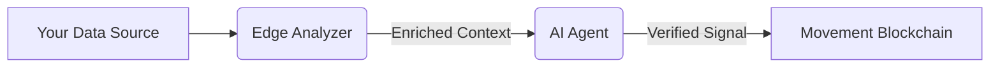

# @fourcast/signal-sdk

**The official SDK for building Modular Intelligence Signals on the Movement Network.**

Fourcast allows developers to build "Edge Analyzers" that process off-chain data (Weather, Traffic, Sentiment) and publish verifiable prediction signals to the Movement M1 blockchain.

## 🚀 Quick Start

### Installation

```bash
npm install @fourcast/signal-sdk
```

### Basic Usage

Publish a simple signal using the generic publisher:

```typescript
import { SignalPublisher, Network } from '@fourcast/signal-sdk';

// 1. Initialize the publisher
const publisher = new SignalPublisher({
  network: Network.MOVEMENT_TESTNET, // or 'custom'
  privateKey: process.env.PRIVATE_KEY, // Agent wallet key
});

// 2. Publish a Signal
await publisher.publish({
  domain: 'weather', // 'weather', 'mobility', 'sentiment', 'onchain'
  marketId: '0x123...market_id',
  title: 'Will it rain during the Super Bowl?',
  confidence: 'HIGH',
  direction: 'YES', // The predicted outcome
  analysis: 'Humidity > 90% and dark clouds observed near stadium.',
});
```

---

## 🛠️ Building a Custom Domain Analyzer

To create a specialized signal feed (e.g., for "Seismic Activity" or "Social Sentiment"), extend the `EdgeAnalyzer` class.

### 1. Create your Analyzer

```javascript
// MyCustomAnalyzer.js
import { EdgeAnalyzer } from '@fourcast/signal-sdk/analysis';

export class MyCustomAnalyzer extends EdgeAnalyzer {
  constructor() {
    super({ name: 'MyCustomAnalyzer' });
  }

  /**
   * Step 1: Fetch external data
   * @param {Object} context - { title, marketId, ... }
   */
  async enrichContext(context) {
    // Fetch data from your API
    const myData = await fetch('https://api.my-data-source.com/v1/stats');
    
    return {
      ...context,
      myData: await myData.json()
    };
  }

  /**
   * Step 2: Construct the AI Prompt
   * @param {Object} context - The enriched context
   */
  constructPrompt(context) {
    return `
      Analyze the market "${context.title}" given this data:
      ${JSON.stringify(context.myData)}
      
      Does this data suggest a YES or NO outcome?
    `;
  }
}
```

### 2. Run the Analysis Pipeline

```javascript
import { MyCustomAnalyzer } from './MyCustomAnalyzer';

const analyzer = new MyCustomAnalyzer();

// Run the full pipeline: Fetch -> Analyze -> Format
const signal = await analyzer.analyze({
  marketId: '0xabc...',
  title: 'Bitcoin > $100k by Friday?'
});

// Output ready for blockchain publishing
console.log(signal);
/*
{
  eventId: '0xabc...',
  confidence: 'MEDIUM',
  aiDigest: 'Data suggests moderate upward trend...',
  ...
}
*/
```

---

## 📦 Architecture

The SDK simplifies the interaction with the Fourcast "Signal Registry" smart contract on Movement.



### Supported Networks

- **Movement M1 (Testnet)**: `https://testnet.movementnetwork.xyz/v1`
- **Aptos Mainnet**: `https://fullnode.mainnet.aptoslabs.com/v1`
- **Custom**: Configure your own RPC URL.

---

## 📜 License

MIT © Fourcast
